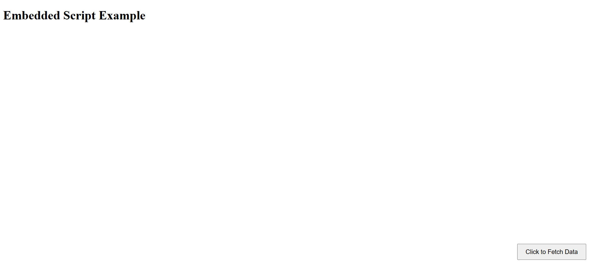

# Embedded Script Example

This project demonstrates how to create an embedded JavaScript function using an Immediately Invoked Function Expression (IIFE). The script is hosted on Vercel and can be embedded in any HTML page or web application, allowing users to interact with dynamic data on their website.

## Output


## Overview

The embedded script is a simple JavaScript function wrapped in an IIFE that adds a button to a webpage. When the button is clicked, it triggers the script to fetch and log data from an API or perform any other action you define.

### How the Script Works

1. **Immediately Invoked Function Expression (IIFE):**  
   The entire JavaScript code is wrapped inside an IIFE. This ensures the script runs immediately upon being loaded and doesn't interfere with the global scope.
   
2. **Button Creation:**  
   The script dynamically creates a button that is positioned fixed at the bottom-right of the page.
   
3. **Click Event:**  
   When the user clicks the button, it triggers a function to fetch data from an API or any other data source you set up. This example uses the placeholder API (`https://jsonplaceholder.typicode.com/posts`) to fetch mock data.
   
4. **Data Handling:**  
   The script fetches the data and logs it to the console, or you can modify it to display the data in any format on the page.

## Steps to Set Up and Test

### 1. Create a New Folder for the Project

Create a folder for your project and navigate into it:

```bash
mkdir embedded-script-project
cd embedded-script-project
```

### 2. Add the JavaScript File

Create a new file `embbed_script.js` in the project directory:

```bash
touch embbed_script.js
```

### 3. Add the Script Code

Paste the following code into the `embbed_script.js` file:

```javascript
(function() {
    // Creating the button
    const button = document.createElement('button');
    button.innerText = "Click to Fetch Data";
    button.style.position = "fixed";
    button.style.bottom = "20px";
    button.style.right = "20px";
    button.style.padding = "10px 20px";
    button.style.fontSize = "16px";
    document.body.appendChild(button);

    // Function to fetch data when the button is clicked
    button.addEventListener('click', function() {
        fetchData();
    });

    // Function to get data from an API or any other source
    async function fetchData() {
        try {
            const response = await fetch('https://jsonplaceholder.typicode.com/posts');
            const data = await response.json();
            console.log(data);  // You can replace this with any functionality to use the data
            alert('Data fetched! Check console.');
        } catch (error) {
            console.error('Error fetching data:', error);
        }
    }
})();
```

### 4. Deploy the Script on Vercel

Follow these steps to deploy the `embbed_script.js` on Vercel:

1. Install Vercel CLI if you don't have it:
```bash
npm install -g vercel
```

2. Create a `vercel.json` file in the project root directory:
```json
{
  "version": 2,
  "builds": [
    {
      "src": "embbed_script.js",
      "use": "@vercel/static"
    }
  ],
  "routes": [
    {
      "src": "/embbed_script.js",
      "dest": "/embbed_script.js"
    }
  ]
}
```

3. Deploy the project to Vercel:
```bash
vercel
```

Follow the prompts and deploy the project. After deployment, you will get a URL where your script is hosted (e.g., `https://welcome-script.vercel.app/embbed_script.js`).

### 5. Test the Script in an HTML Page

Create a new `index.html` file in the same directory and add the following code:

```html
<!DOCTYPE html>
<html lang="en">
<head>
  <meta charset="UTF-8">
  <meta name="viewport" content="width=device-width, initial-scale=1.0">
  <title>Embedded Script Example</title>
</head>
<body>
  <h1>Embedded Script Example</h1>

  <!-- Embedding the script hosted on Vercel -->
  <script src="https://welcome-script.vercel.app/embbed_script.js"></script>
</body>
</html>
```

### 6. Open the HTML Page in Your Browser

1. Open the `index.html` file in your browser
2. You should see a button labeled "Click to Fetch Data" at the bottom-right of the page
3. When you click the button, the script will fetch mock data from the placeholder API and log it to the browser console

## Customizing the Script

You can customize the `embbed_script.js` by:

* Changing the API URL: Replace the fetch URL with the endpoint of any API you want to fetch data from
* Displaying Data: Instead of just logging data to the console, you can modify the script to display the data on the page
* Adding More Features: You can add more features to the button, such as showing a loading spinner or handling errors more gracefully

## Conclusion

This example shows how you can create a simple embedded JavaScript function, deploy it on Vercel, and test it by embedding the script in an HTML page. This setup is flexible and can be extended for various use cases where dynamic, embedded functionality is needed.

For further customization, feel free to modify the script to match your needs!
